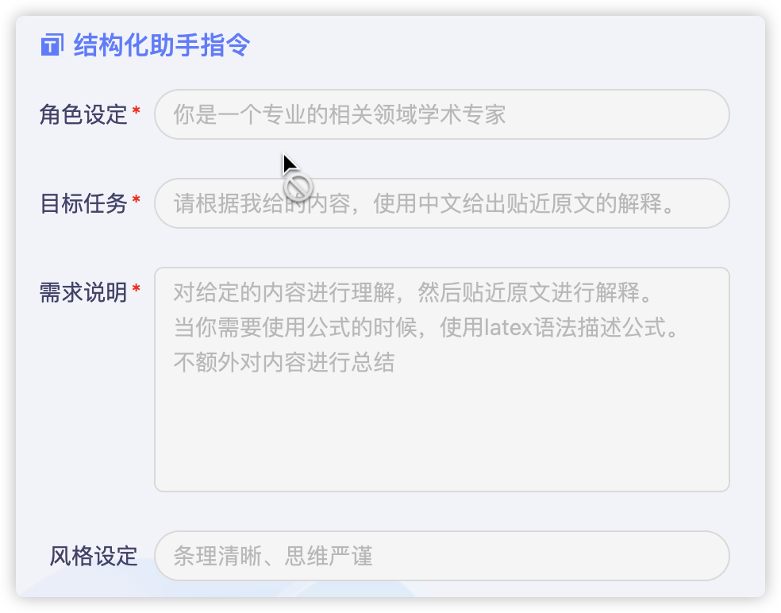
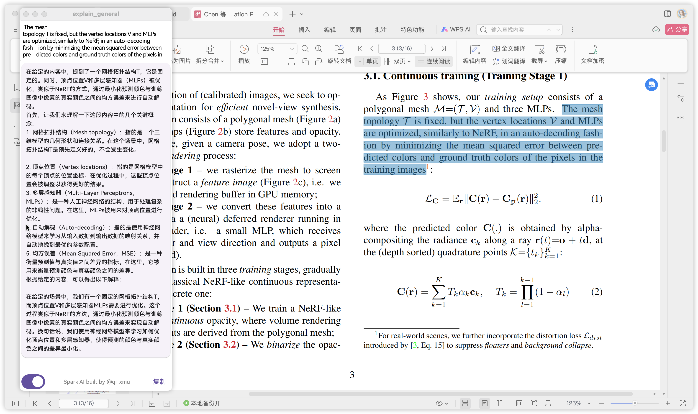

# explain_general

星火Spark桌面小助手快速工具

平台: Mac & Windows & Linux

## Getting Started 快速开始

[video](https://www.bilibili.com/video/BV1wN4y127X3/)

1. 在星火平台[创建助手](https://xinghuo.xfyun.cn/botcenter)并绑定App，获取appId，apiKey等信息。
2. 配置config.json到特定路径（特定路径不同平台不一样，App打开会提示config路径。）


`config.json`

```json
{
  "appId": "xxx",
  "apiKey": "xxxxxxxx",
  "secretKey": "xxxxx",
  "sparkUrl": "wss://xxxxx",
  "domain": "generalv3"
}
```

使用方法：复制内容，自动调用助手进行解释。

## 演示

提示词示例，可以根据自己的需求进行修改。


星火大模型演示


左侧是WSL演示效果，右侧为Windows演示效果。


