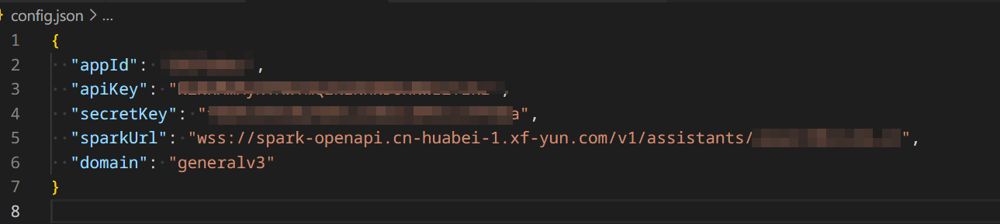
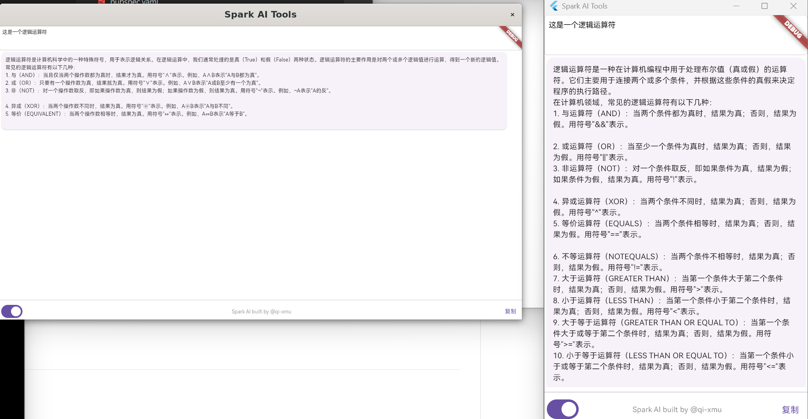

# explain_general

星火Spark桌面小助手快速工具

平台: Mac & Windows & Linux 
 
## Getting Started 快速开始

[video](https://www.bilibili.com/video/BV1wN4y127X3/)

1. 在星火平台创建助手并绑定App，获取appId，apiKey等信息。
2. 配置config.json到特定路径（特定路径不同平台不一样，App打开会提示config路径。）   

使用方法：复制内容，自动调用助手进行解释。

## 演示

左侧是WSL演示效果，右侧为Windows演示效果。

